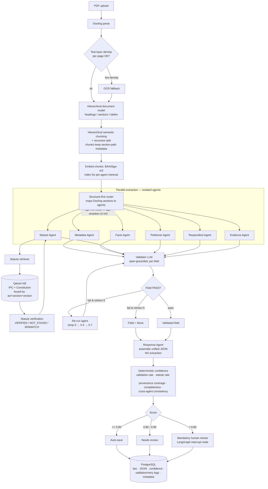
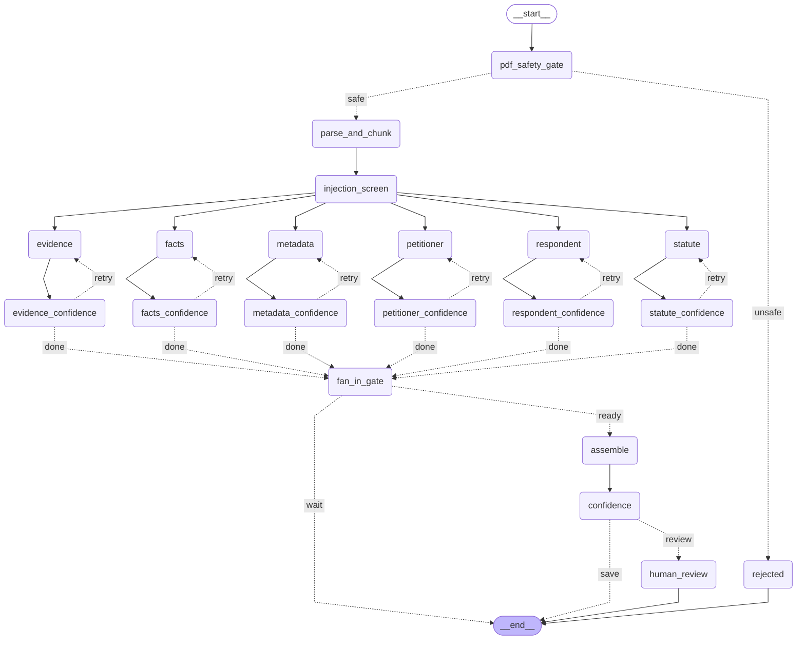

# Legal AI — End-to-End Data Flow

> Recreation/improvement of a Flowise multi-agent workflow as a production Python system.
> Priority: **accuracy > speed**, minimize hallucination, `None` over guessing.

## Design invariants (enforced across the whole pipeline)

1. **Agents are isolated.** Each extraction agent receives only its routed chunks + its prompt (+ retriever for the Statute Agent). No agent reads another agent's output.
2. **RAG is verification-only.** The Qdrant KB (IPC + Constitution) is used *only* by the Statute Agent to verify citations — never to generate extractions.
3. **Every field carries provenance.** `SourceRef` (page + char offsets + verbatim quote). No quote ⇒ cannot be validated ⇒ treated as unsupported.
4. **Validation is a second LLM, span-grounded.** Validator must cite a verbatim source span or the field FAILS. No RAG in validation.
5. **Retries are blind (strict isolation).** No validator feedback reaches the agent; only the sampling temperature varies across attempts (temp 0 → 0.4 → 0.7) so retries can actually recover. Max 3, then `None`.
6. **Confidence is deterministic.** Computed from measurable signals, never produced by an LLM.

## Pipeline

## Orchestration (LangGraph supervisor)

- Fan-out: launch the 6 extraction agents in parallel over their routed inputs.
- Barrier: wait for all agents → trigger validation → drive retries.
- Assembly: hand validated fields to the Response Agent (assembly only).
- Scoring + routing: deterministic confidence → save / review / human interrupt.
- **Checkpointing:** graph state is persisted so a crash mid-run resumes instead of reprocessing a 200-page document.
- **Reproducibility:** temperature 0 baseline, versioned prompts (prompt hash stored per output), tracing via Langfuse.
  - One Langfuse **session per document run** (`traced_run_config` in [observability/langfuse_client.py](../../observability/langfuse_client.py)) so all 6 agents + validator + retries land under a single trace.
  - LangGraph nodes are traced via `langfuse.langchain.CallbackHandler`; any agent that calls OpenRouter directly (outside a LangChain node) uses the traced `get_openrouter_client()` wrapper instead — both paths report to the same trace via the shared session id.

## Compiled LangGraph structure (generated — do not hand-edit)

Regenerate with `python -m pipeline.architecture_doc` after any change to `pipeline/graph.py`,
an agent's prompt, or `pipeline/llm_config.py`. This is the actual compiled `StateGraph`, not
a hand-drawn approximation — the diagram above documents the wider pipeline (parse/chunk/embed/
route) that runs *before* the graph is built; this one documents only the graph itself.

Prefer an image over reading Mermaid source? Open [graph.png](./graph.png) — regenerated
alongside this file, same command.

<!-- GRAPH:START -->

<!-- GRAPH:END -->

### Node reference

<!-- NODES:START -->
| Node | Prompt | Model | Temperature ladder | top_p | max_tokens | Confidence threshold | Writes state field |
|---|---|---|---|---|---|---|---|
| `metadata` | You are the Metadata Agent for an Indian court judgment extraction system. | settings.llm_model | [0.0, 0.4, 0.7] | None | None | — | `metadata` |
| `metadata_confidence` | _(no LLM call — scores AgentValidationResult.pass_rate; loops back to `metadata` on retry, else -> assemble)_ | — | — | — | — | 1.0 | `validations`, `retry_counts`, `retry_decision` |
| `facts` | You are the Facts Agent for an Indian court judgment extraction system. | settings.llm_model | [0.0, 0.4, 0.7] | None | None | — | `facts` |
| `facts_confidence` | _(no LLM call — scores AgentValidationResult.pass_rate; loops back to `facts` on retry, else -> assemble)_ | — | — | — | — | 1.0 | `validations`, `retry_counts`, `retry_decision` |
| `statute` | You are the Statute Agent for an Indian court judgment extraction system. | settings.llm_model | [0.0, 0.4, 0.7] | None | None | — | `statutes` |
| `statute_confidence` | _(no LLM call — scores AgentValidationResult.pass_rate; loops back to `statute` on retry, else -> assemble)_ | — | — | — | — | 1.0 | `validations`, `retry_counts`, `retry_decision` |
| `petitioner` | You are the Petitioner Agent for an Indian court judgment extraction system. _(template, params={'side': 'petitioner'})_ | settings.llm_model | [0.0, 0.4, 0.7] | None | None | — | `petitioner` |
| `petitioner_confidence` | _(no LLM call — scores AgentValidationResult.pass_rate; loops back to `petitioner` on retry, else -> assemble)_ | — | — | — | — | 1.0 | `validations`, `retry_counts`, `retry_decision` |
| `respondent` | You are the Respondent Agent for an Indian court judgment extraction system. _(template, params={'side': 'respondent'})_ | settings.llm_model | [0.0, 0.4, 0.7] | None | None | — | `respondent` |
| `respondent_confidence` | _(no LLM call — scores AgentValidationResult.pass_rate; loops back to `respondent` on retry, else -> assemble)_ | — | — | — | — | 1.0 | `validations`, `retry_counts`, `retry_decision` |
| `evidence` | You are the Evidence Agent for an Indian court judgment extraction system. | settings.llm_model | [0.0, 0.4, 0.7] | None | None | — | `evidence` |
| `evidence_confidence` | _(no LLM call — scores AgentValidationResult.pass_rate; loops back to `evidence` on retry, else -> assemble)_ | — | — | — | — | 1.0 | `validations`, `retry_counts`, `retry_decision` |
| `fan_in_gate` | _(no LLM call — manual barrier; only proceeds to assemble once agents_done covers all 6 agents)_ | — | — | — | — | — | — |
| `pdf_safety_gate` | _(no LLM call — structural PDF scan, pipeline/pdf_safety.py)_ | — | — | — | — | — | `pdf_safety_reasons` |
| `parse_and_chunk` | _(no LLM call — Docling parse + chunk, only reached if pdf_safety_gate passes)_ | — | — | — | — | — | `chunk_count`, `ocr_used`, `agent_inputs` |
| `injection_screen` | _(no LLM call — pattern scan, pipeline/injection_screen.py)_ | — | — | — | — | — | `injection_matches` |
| `rejected` | _(no LLM call — terminal node for an unsafe PDF)_ | — | — | — | — | — | — |
| `assemble` | _(no LLM call — statute verification only, pipeline.agents.response assembly happens in \`confidence\`)_ | — | — | — | — | — | `statutes` |
| `confidence` | _(no LLM call — document-level ConfidenceBreakdown + builds the final result)_ | — | — | — | — | — | `confidence`, `result` |
| `human_review` | _(no LLM call — interrupt() pauses for a human decision)_ | — | — | — | — | — | `result` |
<!-- NODES:END -->

## Known, accepted limitation

KB is **IPC + Constitution only**. Post-2024 judgments citing **BNS/BNSS/BSA** will not verify. The KB schema stores `act` + `act_version` + `effective_dates` so BNS can be added later as configuration, not a rewrite, and so a section number is always matched against the *correct* act rather than blindly.
