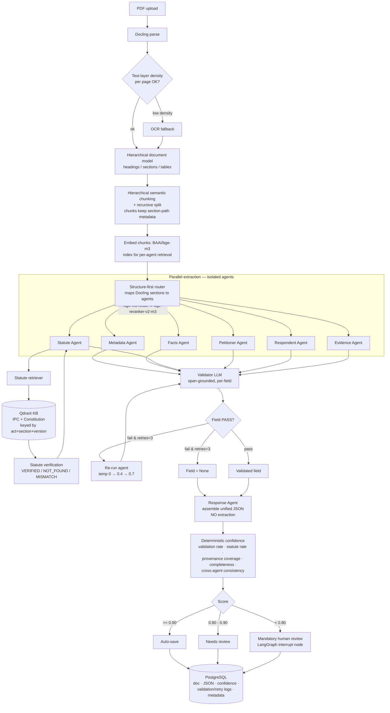

# Legal AI — End-to-End Data Flow

> Recreation/improvement of a Flowise multi-agent workflow as a production Python system.
> Priority: **accuracy > speed**, minimize hallucination, `None` over guessing.

## Design invariants (enforced across the whole pipeline)

1. **Agents are isolated.** Each extraction agent receives only its routed chunks + its prompt (+ retriever for the Statute Agent). No agent reads another agent's output.
2. **RAG is verification-only.** The Qdrant KB (IPC + Constitution) is used *only* by the Statute Agent to verify citations — never to generate extractions.
3. **Every field carries provenance.** `SourceRef` (page + char offsets + verbatim quote). No quote ⇒ cannot be validated ⇒ treated as unsupported.
4. **Validation is a second LLM, span-grounded.** Validator must cite a verbatim source span or the field FAILS. No RAG in validation.
5. **Retries are blind (strict isolation).** No validator feedback reaches the agent; only the sampling temperature varies across attempts (temp 0 → 0.4 → 0.7) so retries can actually recover. Max 3, then `None`.
6. **Confidence is deterministic.** Computed from measurable signals, never produced by an LLM.

## Pipeline

## Orchestration (LangGraph supervisor)

- Fan-out: launch the 6 extraction agents in parallel over their routed inputs.
- Barrier: wait for all agents → trigger validation → drive retries.
- Assembly: hand validated fields to the Response Agent (assembly only).
- Scoring + routing: deterministic confidence → save / review / human interrupt.
- **Checkpointing:** graph state is persisted so a crash mid-run resumes instead of reprocessing a 200-page document.
- **Reproducibility:** temperature 0 baseline, versioned prompts (prompt hash stored per output), tracing via Langfuse.
  - One Langfuse **session per document run** (`traced_run_config` in [observability/langfuse_client.py](../../observability/langfuse_client.py)) so all 6 agents + validator + retries land under a single trace.
  - LangGraph nodes are traced via `langfuse.langchain.CallbackHandler`; any agent that calls OpenRouter directly (outside a LangChain node) uses the traced `get_openrouter_client()` wrapper instead — both paths report to the same trace via the shared session id.

## Known, accepted limitation

KB is **IPC + Constitution only**. Post-2024 judgments citing **BNS/BNSS/BSA** will not verify. The KB schema stores `act` + `act_version` + `effective_dates` so BNS can be added later as configuration, not a rewrite, and so a section number is always matched against the *correct* act rather than blindly.
